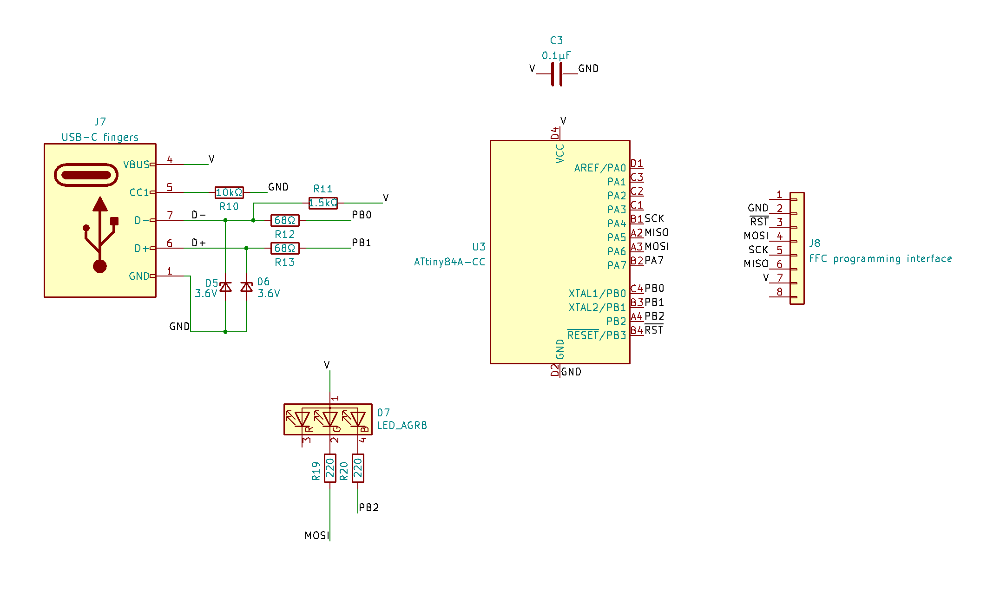

# USB-C PCB Experiments

This is part of an ongoing series of projects involving creative interpretations of the USB mechanical standards. You've probably seen [2.0mm thick PCBs that fit in USB ports](http://digistump.com/products/1), and maybe you've seen [0.6mm thick PCBs that fit in USB-Micro cables](https://twitter.com/DHammarskjold/status/1285291152602796032). So what about USB-C? T​he plastic tab inside a USB-C port is about 0.7mm thick. I think [bobricius](https://hackaday.io/bobricius) has had success using 0.8mm thick PCBs; 0.6mm thick PCBs are way too loose. I haven't found a fab that will do 0.7mm (or 28 mil) PCBs unless you special-order an entire panel.​

So, what other ways are there to reach 0.7mm thickness? My original plan was to join an 0.1mm flex PCB and an 0.6mm FR4 PCB, but then I realized: you know what else is 0.6mm thick? The ATtiny84A BGA package. Granted, there are only contacts on one side of the PCB, but that shouldn't matter with the symmetric USB-C pinout, right? ...Right? (foreshadowing)

The 3mm-square ATtiny acts as a stiffener for the flex PCB, and it comes out to 0.7mm on the dot! I only have an imperial set of calipers as seen above. The dial shows 0.0275 inches, which is 0.6985 millimeters. So this is looking pretty promising.

What would you do with an ATtiny that lives inside your USB-C cable? I have a few ideas for demonstrations at the moment.

## Demo 1: RGB LED that can't be programmed over USB

There are two revisions of this design; the schematics are in the repo as `rgb_no_bootloader.kicad_sch` and `rgb_no_bootloader_r2.kicad_sch`. Revision 1 is the one that I have assembled and ready to work with, it's also the one I would like some code help with! My current code is in the in the code folder as `demo_1_revision_1`; it is saved as an Arduino .ino file but it should work fine with AVR-GCC without any changes.

This demo is as simple as possible: the microcontroller controlls an RGB LED that juuuust barely pokes out of the USB-C cable plug. It has to be programmed using that 8-pin FFC connector, and then the FFC connector has to be snipped off in order to use the dang thing. Right now I have one fully-soldered board, but I haven't cut the FFC connector yet because I would like some help improving the code.

Demo 1 Revision 2 is necessary because, on revision 1, the RGB LED is *not* connected to the Fast-PWM-enabled pins on the microcontroller. As a result I have to use [binary code modulation](http://www.batsocks.co.uk/readme/art_bcm_3.htm) to achieve any sort of brightness control. It's working alright, [as shown here](https://twitter.com/DHammarskjold/status/1475741148522049536), but I'm not confident enough with the code to chop off the programming connector yet.

As you can see, there is a large tab sticking out so I can grab and remove the PCB from the cable. However, out of spite for, uh, myself, I have labelled it the "cowards' tab." Past me is encouraging present me to remove that tab and make the board impossible to remove, thereby turning a useful cable into a cute little art piece for all eternity.

## Demo 2: RGB LED that *can* be programmed over USB
*TODO: migrate these files to KiCad 6, add to repo, and update this document*

It would be nice to use the USB data lines to program the microcontroller! I didn't attempt this for the first revision because I wanted to keep the board as uncluttered and simple as possible. It will result in a denser board that may need more careful soldering, but it should be possible!

As I understand it, I need to add at least five extra components: a pullup for the D- line, small resistors on the D- and D+ lines, and zener diodes as level shifters. This is the low-complexity approach used on the Digispark and its derivatives. I have not attempted to make this board yet. Also, look at the 3d render above; doesn't it look like an owl? I love it.

There is an interesting issue, however. In the USB-C standard, the D+/D- lines are only connected on one side of the plug! It assumes that the USB-C port has D+/D- connectors on both sides, so the plug orientation should not matter. But our USB-C port only has D+/D- connectors on one side. We've reintroduced the classic USB behavior of having to flip the device over 3 times before it works!

## Demo 3: Basically a Digispark but smaller

In this version, the FFC portion is meant to stay attached! And all the components are 0402-sized with generous spacing so I can worry less when soldering. As a result it can be used in a slightly more "normal" fashion—still operable by sticking it inside a USB-C cable, but now there's a breakout of sorts.
